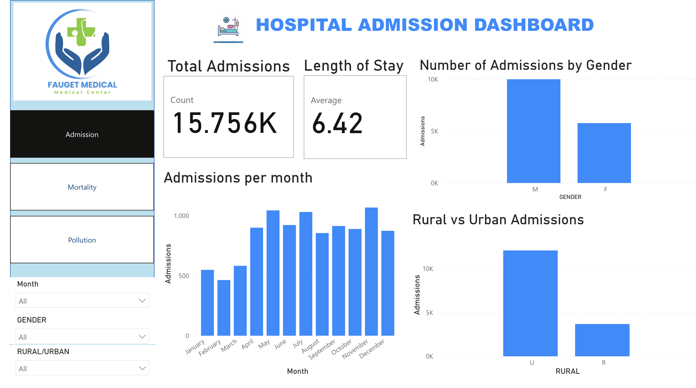
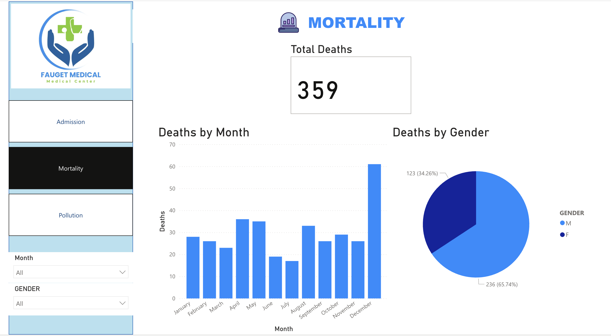
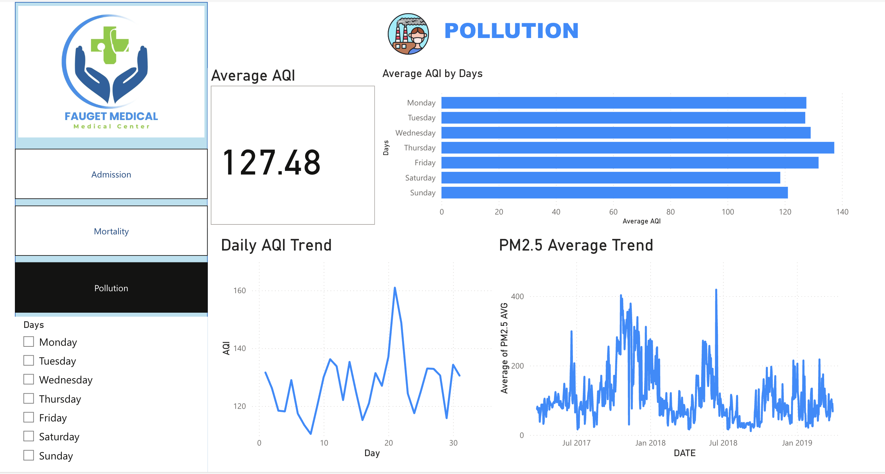

# 🏥 Hospital Analytics Dashboard (Power BI)   

## 📊 Dashboard Overview  

### 🏥 Hospital Admission Dashboard  
  

### ☠ Mortality Dashboard  
  

### 🌍 Pollution & AQI Dashboard  

   

## 📌 Project Overview  

This project presents a multi-page Power BI dashboard analyzing hospital admission, mortality, and pollution data. The dashboard provides insights into healthcare trends using interactive filters and KPI metrics.  

---  

## 📊 Dashboards Included  

### 1️⃣ Hospital Admission Dashboard  
- Total Admissions  
- Average Length of Stay  
- Admissions by Gender  
- Rural vs Urban Analysis  
- Monthly Admission Trends  

### 2️⃣ Mortality Dashboard  
- Total Deaths  
- Deaths by Month  
- Deaths by Gender  

### 3️⃣ Pollution Dashboard  
- Average AQI  
- AQI by Day  
- Daily AQI Trends  
- PM2.5 Analysis  

---  

## 🛠 Tools Used  
- Power BI  
- DAX  
- Data Modeling  
- Data Visualization  

---

## 🎯 Key Insights  
- Male admissions higher than female  
- Urban admissions significantly higher than rural  
- AQI spikes correlate with certain months  
- Seasonal trend in mortality data  

---  

## 📂 Files Included  
- Hospital_Analytics_Dashboard.pbix  
- Dashboard screenshots (assets folder)  

---  

## 🎥 Dashboard Demo Video  

Watch the full demo here:    
👉 [Click to Watch](https://www.linkedin.com/posts/dr-tanya-agrawal-618b002ba_healthcareanalytics-powerbi-dataanalytics-activity-7402966547796885504-71ju?utm_source=share&utm_medium=member_desktop&rcm=ACoAAEyxp3QBHrE8Iv-3o9rMHNpaOeVL1rf6NwI)    

## 👩‍💻 Author
Tanya Agrawal  
BDS | AI & Healthcare Analytics Enthusiast
